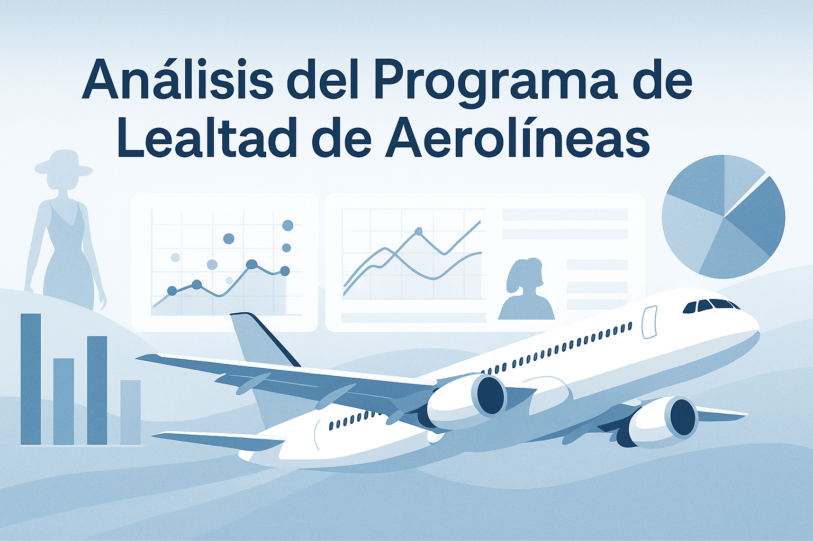

# ✈️ Airline Loyalty Program Analysis

---

## 🇬🇧 English

This project explores customer loyalty in the airline industry through data analysis and visualization using Python. It includes data cleaning, EDA, visual insights, and an initial ETL process.

---

### 📂 Datasets
Two datasets are used:

- `Customer Flight Analysis.csv`: Monthly flight and points data.
- `Customer Loyalty History.csv`: Demographic, financial and membership profile of each customer.

They are linked by the `Loyalty Number` column.

---

### 🧹 Phase 1: Data Exploration and Cleaning
- Initial data loading and display (`head`, `info`, `describe`)
- Detection of nulls and duplicates
- Data type conversion and validation
- Merging datasets using `Loyalty Number`
- Cleaning:
  - Negative values (converted to absolute)
  - Missing salaries (imputed with median)
  - Irrelevant or inconsistent records

---

### 📊 Phase 2: Visualization
Visualizations were created to answer key business questions:

- 📅 Monthly bookings: flights per month and per month/year
- 📈 Distance vs. loyalty points correlation
- 🗺️ Customer distribution by province
- 🎓 Average salary by education level
- 💳 Distribution by loyalty card type
- ⚧️ 💍 Gender and marital status distribution

Matplotlib and Seaborn were used for plotting.

---

### 🧠 Phase 3: Analysis, Conclusions & Next Steps
This analysis provides valuable insights into customer value, behavioral patterns over time, and how variables like education, gender, or card type relate to loyalty activity.

The notebook includes a summary of final conclusions and proposed next steps.

---

### 🛠️ Phase 4: ETL (in progress)
In the `ETL` folder you'll find a basic ETL process for:
- Exploring source files
- Generating a new unified CSV with relevant fields

Run `main.py` from terminal to execute this phase.

---

## 🇪🇸 Español

Este proyecto analiza la fidelización de clientes en el sector aéreo mediante limpieza de datos, análisis exploratorio y visualizaciones con Python. También se incluye un proceso ETL básico.

---

### 📂 Conjuntos de Datos
Se utilizan dos archivos:

- `Customer Flight Analysis.csv`: Datos mensuales de vuelos y puntos de clientes.
- `Customer Loyalty History.csv`: Perfil demográfico, financiero y de membresía de cada cliente.

Ambos se enlazan por la columna `Loyalty Number`.

---

### 🧹 Fase 1: Exploración y Limpieza
- Carga y visualización inicial de datos (`head`, `info`, `describe`)
- Revisión de valores nulos y duplicados
- Conversión y validación de tipos de datos
- Unificación de los datasets por `Loyalty Number`
- Limpieza de:
  - Valores negativos (convertidos a absolutos)
  - Salarios nulos (imputados por mediana)
  - Registros irrelevantes o inconsistentes

---

### 📊 Fase 2: Visualización
Se realizaron diversas visualizaciones para responder preguntas clave del negocio:

- 📅 Reservas mensuales: vuelos por mes y por mes/año
- 📈 Relación entre distancia y puntos acumulados
- 🗺️ Distribución de clientes por provincia
- 🎓 Comparación de salario promedio por nivel educativo
- 💳 Proporción de clientes según tipo de tarjeta de fidelidad
- ⚧️ 💍 Distribución por género y estado civil

Se usaron Matplotlib y Seaborn para las gráficas.

---

### 🧠 Fase 3: Análisis, Conclusiones y Siguientes Pasos
El análisis permite entender mejor el valor de los clientes, su comportamiento a lo largo del tiempo y cómo variables como educación, género o tipo de tarjeta se relacionan con su actividad.

El notebook incluye conclusiones y próximos pasos sugeridos.

---

### 🛠️ Fase 4: ETL (en progreso)
En la carpeta `ETL` se encuentra un proceso ETL básico para:
- Explorar los archivos de origen
- Crear un nuevo CSV con los datos relevantes

Ejecutar `main.py` desde la terminal para lanzar esta fase.

---

## 🇮🇹 Italiano

Questo progetto analizza la fidelizzazione dei clienti nel settore aereo attraverso pulizia, esplorazione e visualizzazione dei dati con Python. Include anche una fase ETL iniziale.

---

### 📂 Dataset
Sono utilizzati due file:

- `Customer Flight Analysis.csv`: Dati mensili di voli e punti cliente
- `Customer Loyalty History.csv`: Profilo demografico, finanziario e di iscrizione per ciascun cliente

I due dataset sono uniti tramite la colonna `Loyalty Number`.

---

### 🧹 Fase 1: Esplorazione e Pulizia
- Caricamento e visualizzazione iniziale dei dati (`head`, `info`, `describe`)
- Ricerca di valori nulli e duplicati
- Conversione e validazione dei tipi di dato
- Unione dei dataset usando `Loyalty Number`
- Pulizia:
  - Valori negativi (convertiti in assoluti)
  - Stipendi mancanti (imputati con la mediana)
  - Record irrilevanti o incoerenti

---

### 📊 Fase 2: Visualizzazione
Sono state realizzate visualizzazioni per rispondere a domande strategiche:

- 📅 Prenotazioni mensili: voli per mese e mese/anno
- 📈 Correlazione tra distanza e punti fedeltà
- 🗺️ Distribuzione dei clienti per provincia
- 🎓 Salario medio per livello di istruzione
- 💳 Distribuzione per tipo di carta fedeltà
- ⚧️ 💍 Distribuzione per genere e stato civile

Matplotlib e Seaborn sono stati utilizzati per i grafici.

---

### 🧠 Fase 3: Analisi, Conclusioni e Prossimi Passi
L'analisi offre insight preziosi sul valore e comportamento dei clienti nel tempo, e su come variabili come istruzione, genere o tipo di carta influenzino la partecipazione al programma di fidelizzazione.

Le conclusioni e i prossimi step sono descritti nel notebook.

---

### 🛠️ Fase 4: ETL (in corso)
Nella cartella `ETL` si trova un processo ETL base per:
- Esplorare i file originali
- Creare un nuovo CSV unificato con i dati rilevanti

Eseguire `main.py` dal terminale per avviare questa fase.

---
